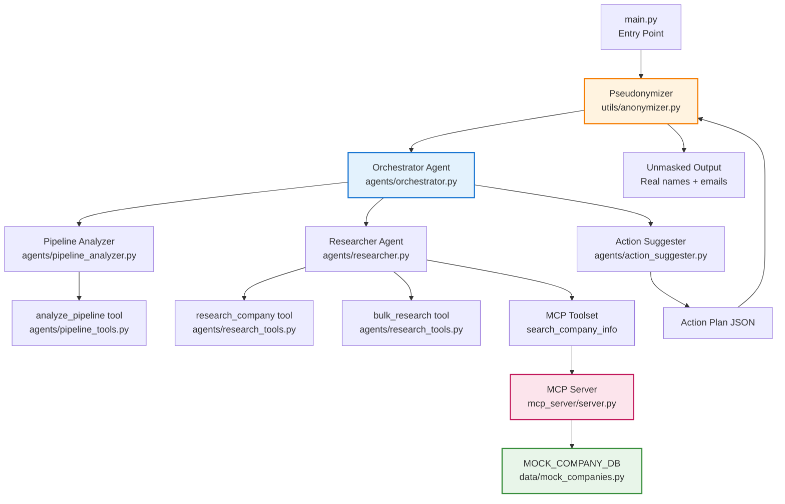

# 🏢 Pipeline Suggester

**An AI agent system that analyzes your sales pipeline, identifies stagnant deals, researches the accounts, and drafts personalized outreach emails.**

> Built for the **Kaggle × Google AI Agents: Intensive Vibe Coding Capstone** — *Agents for Business* track.

---

## 🎯 Problem

Sales teams lose millions in stalled deals. When a deal goes quiet for weeks, reps often lack the context or time to re-engage effectively. Stagnant deals pile up, pipeline forecasts rot, and revenue walks out the door.

## 💡 Solution

Pipeline Suggester is a multi-agent system that automates pipeline health checks:

1. **Analyzes** your CRM pipeline CSV to flag deals with no activity for 14+ days
2. **Researches** each flagged company for context (industry, news, buying signals)
3. **Suggests** a next-best-action and drafts a personalized outreach email

Agents reason over your data so your sales team spends less time diagnosing pipeline and more time closing deals.

---

## 🏗️ Architecture



### Agent Communication

The three sub-agents communicate **sequentially through the orchestrator**: the Pipeline Analyzer flags stagnant deals and passes them to the Researcher; the Researcher enriches those deals with MCP-sourced company context; the Action Suggester combines both outputs to produce next-best-actions and draft emails. Because all sub-agents run under one ADK root agent, each step's output is added to the shared conversation context — the next sub-agent naturally sees what the previous one produced without explicit APIs or queuing.

---

## 🔐 Security — Pseudonymization

Before any data reaches the LLM, the `Pseudonymizer` in `utils/anonymizer.py` replaces sensitive fields with reversible tokens:

| Original | Token |
|---|---|
| Acme Corp | `[COMPANY_1]` |
| John Smith | `[CONTACT_1]` |
| john@acmecorp.com | `[EMAIL_1]` |

After the Action Suggester returns draft emails with tokens, the orchestrator **unmasks** them using the reverse mapping, so the final output contains real names and addresses. The LLM never sees PII — only the mapping stored in local memory.

---

## ✅ Course Concepts Demonstrated

| Concept | Where Demonstrated |
|---|---|
| **Agent / Multi-agent system (ADK)** | `agents/orchestrator.py` — root agent with 3 `sub_agents` |
| **MCP Server** | `mcp_server/server.py` — FastMCP server with 2 tools, stdio transport |
| **Antigravity** | Video demo — interactive review of pipeline results |
| **Security features** | `utils/anonymizer.py` — reversible pseudonymization of PII |
| **Deployability** | Video demo — cloud deployment walkthrough |
| **Agent skills (Agents CLI)** | `main.py` — CLI entry point with argparse + `.env` config |

---

## 🚀 Quick Start

### Prerequisites

- Python 3.10+
- A [Google AI Studio API key](https://aistudio.google.com/apikey)

### Setup

```bash
# 1. Clone the repository
git clone https://github.com/HuyVQ2146/Pipeline-Suggester
cd pipeline-suggester

# 2. Create a virtual environment
python -m venv .venv

# Windows
.venv\Scripts\activate

# macOS / Linux
source .venv/bin/activate

# 3. Install dependencies
pip install -r requirements.txt

# 4. Configure your API key
copy .env.example .env
# Edit .env and add your GOOGLE_API_KEY
```

### Run

```bash
# With the bundled sample data
python main.py

# With your own CRM CSV
python main.py --csv path/to/your_pipeline.csv
```

### Expected Output

```
⚙️  Stagnant threshold: 14 days
📂 Reading pipeline data from: data/sample_pipeline.csv
🔒 Pseudonymized 10 rows. Tokens: {'Acme Corp': '[COMPANY_1]', ...}
🚀 Starting Pipeline Suggester agent workflow...

[Agent outputs stream here...]

🔓 Unmasking pseudonymized tokens in outreach emails...

======================================================================
FINAL ACTION PLAN (unmasked)
======================================================================
[Full action plan with real names and draft emails]
```

---

## 📁 Project Structure

```
pipeline_suggester/
├── .env.example              # API key + config template
├── .gitignore                # Excludes .env, __pycache__, venvs
├── README.md                 # This file
├── requirements.txt          # Python dependencies
├── pyproject.toml            # Project metadata
├── main.py                   # CLI entry point — pseudonymize → run → unmask
├── data/
│   └── sample_pipeline.csv   # 10-row sample CRM pipeline
├── mcp_server/
│   ├── __init__.py
│   └── server.py             # FastMCP server (read_pipeline_csv, search_company_info)
├── agents/
│   ├── __init__.py
│   ├── pipeline_analyzer.py  # Sub-agent 1: flag stagnant deals + risk scores
│   ├── researcher.py        # Sub-agent 2: company context via MCP tools
│   ├── action_suggester.py  # Sub-agent 3: next-best-action + draft emails
│   └── orchestrator.py       # Root agent: coordinates sub-agents
└── utils/
    ├── __init__.py
    └── anonymizer.py         # Pseudonymizer — mask/unmask PII
```

## 📊 CSV Format

Your pipeline CSV should have these columns:

| Column | Type | Example | Sensitive? |
|---|---|---|---|
| `Deal_ID` | string | D001 | No |
| `Company_Name` | string | Acme Corp | **Yes — pseudonymized** |
| `Contact_Name` | string | John Smith | **Yes — pseudonymized** |
| `Contact_Email` | string | john@acme.com | **Yes — pseudonymized** |
| `Deal_Value` | integer | 50000 | No |
| `Stage` | string | Negotiation | No |
| `Last_Activity_Date` | date | 2025-06-15 | No |
| `Owner` | string | Alice | No |

---

## 🛠️ Extending This Project

- **Real company data**: Replace `MOCK_COMPANY_DB` in `mcp_server/server.py` with calls to a real API (Clearbit, Crunchbase, etc.)
- **CRM integration**: Add an MCP tool that connects to Salesforce/HubSpot via their APIs
- **Email delivery**: Add a tool that sends the unmasked draft email via SendGrid/Mailgun
- **Deploy to Cloud Run**: Containerize with Docker and deploy to Google Cloud Run for a production endpoint
- **Historical trends**: Feed multiple CSVs over time to detect deal velocity changes

---

## ☁️ Deploy to Cloud Run (Public Demo)

Deploy the full agent system to Google Cloud Run for a public HTTPS endpoint.

### Prerequisites
- Google Cloud project with billing enabled
- `gcloud` CLI installed and authenticated
- Docker installed (for local build) or use Cloud Build

### Step 1: Create a Dockerfile

```dockerfile
# Dockerfile
FROM python:3.11-slim

WORKDIR /app

# Install system dependencies
RUN apt-get update && apt-get install -y --no-install-recommends \
    gcc \
    && rm -rf /var/lib/apt/lists/*

# Copy requirements first for better caching
COPY requirements.txt .
RUN pip install --no-cache-dir -r requirements.txt

# Copy application code
COPY . .

# Expose port (Cloud Run expects 8080)
ENV PORT=8080
EXPOSE 8080

# Run the web UI (or use main.py for CLI)
CMD ["python", "web_app.py"]
```

### Step 2: Create a Web UI (`web_app.py`)

Create a simple Flask/FastAPI wrapper that calls the agent pipeline via HTTP:

```python
# web_app.py
import os
import json
import asyncio
from flask import Flask, request, jsonify, render_template_string
from dotenv import load_dotenv

load_dotenv()

# Import the pipeline logic
from main import run_pipeline
from utils.anonymizer import Pseudonymizer
from agents.pipeline_tools import analyze_pipeline
from agents.research_tools import bulk_research, set_reverse_mapping
import pandas as pd

app = Flask(__name__)

HTML_TEMPLATE = """
<!DOCTYPE html>
<html>
<head>
    <title>Pipeline Suggester</title>
    <style>
        body { font-family: -apple-system, BlinkMacSystemFont, 'Segoe UI', Roboto, sans-serif; max-width: 900px; margin: 0 auto; padding: 20px; }
        .deal { border: 1px solid #e0e0e0; border-radius: 8px; padding: 20px; margin: 15px 0; }
        .critical { border-left: 5px solid #d32f2f; }
        .high { border-left: 5px solid #f57c00; }
        .moderate { border-left: 5px solid #388e3c; }
        .risk-badge { display: inline-block; padding: 4px 12px; border-radius: 12px; font-size: 12px; font-weight: bold; }
        .risk-critical { background: #ffebee; color: #c62828; }
        .risk-high { background: #fff3e0; color: #e65100; }
        .risk-moderate { background: #e8f5e9; color: #2e7d32; }
        .email { background: #f5f5f5; padding: 15px; border-radius: 4px; white-space: pre-wrap; font-family: monospace; font-size: 13px; }
        button { background: #1976d2; color: white; border: none; padding: 12px 24px; border-radius: 4px; cursor: pointer; font-size: 16px; }
        button:hover { background: #1565c0; }
        .loader { display: none; text-align: center; margin: 20px; }
        .summary { background: #e3f2fd; padding: 15px; border-radius: 8px; margin-bottom: 20px; }
    </style>
</head>
<body>
    <h1>🏢 Pipeline Suggester</h1>
    <p>Upload your CRM pipeline CSV to get AI-powered re-engagement actions and draft emails.</p>
    
    <form id="uploadForm" enctype="multipart/form-data">
        <input type="file" name="csv" accept=".csv" required>
        <button type="submit">Analyze Pipeline</button>
    </form>
    
    <div class="loader" id="loader">🤖 Analyzing... (this takes ~30-60 seconds)</div>
    <div id="results"></div>

    <script>
        document.getElementById('uploadForm').addEventListener('submit', async (e) => {
            e.preventDefault();
            const formData = new FormData(e.target);
            document.getElementById('loader').style.display = 'block';
            document.getElementById('results').innerHTML = '';
            
            const res = await fetch('/analyze', { method: 'POST', body: formData });
            const data = await res.json();
            
            document.getElementById('loader').style.display = 'none';
            
            if (data.error) {
                document.getElementById('results').innerHTML = `<div style="color:red;">Error: ${data.error}</div>`;
                return;
            }
            
            renderResults(data);
        });
        
        function renderResults(data) {
            let html = `<div class="summary">
                <h3>📊 Pipeline Summary</h3>
                <p><strong>${data.summary.total_deals}</strong> flagged deals | 
                <span class="risk-badge risk-critical">${data.summary.critical_count} CRITICAL</span> | 
                <span class="risk-badge risk-high">${data.summary.high_count} HIGH</span> | 
                <span class="risk-badge risk-moderate">${data.summary.moderate_count} MODERATE</span> |
                Value at risk: $${data.summary.pipeline_value_at_risk.toLocaleString()}</p>
            </div>`;
            
            data.actions.forEach((action, i) => {
                const riskClass = action.risk_level.toLowerCase();
                html += `<div class="deal ${riskClass}">
                    <h3>${action.deal_id} — ${action.company} 
                        <span class="risk-badge risk-${riskClass}">${action.risk_level} (${action.risk_score})</span>
                    </h3>
                    <p><strong>Days Stagnant:</strong> ${action.days_stagnant} | <strong>Stage:</strong> ${action.stage} | <strong>Value:</strong> $${action.deal_value.toLocaleString()}</p>
                    <p><strong>📋 Next Best Action:</strong> ${action.next_best_action}</p>
                    <p><strong>📧 Draft Email:</strong></p>
                    <div class="email">${action.draft_email}</div>
                </div>`;
            });
            
            document.getElementById('results').innerHTML = html;
        }
    </script>
</body>
</html>
"""

async def analyze_pipeline_async(csv_file):
    """Run the full pipeline analysis."""
    # Read CSV
    df = pd.read_csv(csv_file)
    
    # Pseudonymize
    pseudo = Pseudonymizer()
    masked_rows = [pseudo.pseudonymize_row(row.to_dict()) for _, row in df.iterrows()]
    
    # Build reverse mapping
    reverse_map = pseudo.get_reverse_mapping()
    set_reverse_mapping(reverse_map)
    
    # Analyze pipeline
    result = analyze_pipeline(
        csv_file=None,  # We'll pass data directly
        stagnant_threshold_days=14,
        reference_date="2025-06-30",
    )
    analysis = json.loads(result)
    
    # Get flagged deals
    flagged = analysis["flagged_deals"]
    
    # Research companies
    company_tokens = [d["Company_Name"] for d in flagged]
    research_json = bulk_research(json.dumps(company_tokens))
    research = json.loads(research_json)
    
    # Build company info map
    company_info = {}
    for r in research["results"]:
        company_info[r["company"]] = r
    
    # Generate action plans (simplified - in production use Action Suggester agent)
    actions = []
    for deal in flagged:
        token = deal["Company_Name"]
        info = company_info.get(token, {})
        summary = info.get("summary", "No research available")
        
        actions.append({
            "deal_id": deal["Deal_ID"],
            "company": pseudo.unmask(token),
            "risk_level": deal["Risk_Level"],
            "risk_score": deal["Risk_Score"],
            "days_stagnant": deal["Days_Stagnant"],
            "stage": deal["Stage"],
            "deal_value": deal["Deal_Value"],
            "next_best_action": f"Schedule re-engagement call within {2 if deal['Risk_Level'] == 'CRITICAL' else 7 if deal['Risk_Level'] == 'HIGH' else 14} days. Reference: {summary}",
            "draft_email": f"Subject: Reconnecting on your {deal['Stage'].lower()} discussion\n\nHi {pseudo.unmask(deal['Contact_Name'])},\n\nIt's been {deal['Days_Stagnant']} days since we last connected about the {deal['Stage']} with {pseudo.unmask(token)} ({deal['Deal_Value']:,.0f}).\n\nBased on recent intelligence: {summary}\n\nI'd love to schedule a brief call to discuss how we can help. Would {['this week', 'next week', 'the next two weeks'][{'CRITICAL': 0, 'HIGH': 1, 'MODERATE': 2}[deal['Risk_Level']]]} work?\n\nBest,\n{pseudo.unmask(deal['Contact_Name'])}\n{pseudo.unmask(deal['Contact_Email'])}"
        })
    
    # Unmask actions
    for action in actions:
        action["company"] = pseudo.unmask(action["company"])
        action["draft_email"] = pseudo.unmask(action["draft_email"])
    
    return {
        "summary": analysis["summary"],
        "actions": actions
    }

@app.route("/")
def index():
    return HTML_TEMPLATE

@app.route("/analyze", methods=["POST"])
def analyze():
    if 'csv' not in request.files:
        return jsonify({"error": "No CSV file uploaded"}), 400
    
    file = request.files['csv']
    if file.filename == '':
        return jsonify({"error": "No file selected"}), 400
    
    try:
        # Save temporarily
        import tempfile
        with tempfile.NamedTemporaryFile(mode='wb', suffix='.csv', delete=False) as tmp:
            file.save(tmp)
            tmp_path = tmp.name
        
        # Run analysis
        result = asyncio.run(analyze_pipeline_async(tmp_path))
        
        # Cleanup
        os.unlink(tmp_path)
        
        return jsonify(result)
    except Exception as e:
        return jsonify({"error": str(e)}), 500

if __name__ == "__main__":
    port = int(os.environ.get("PORT", 8080))
    app.run(host="0.0.0.0", port=port, debug=False)
```

### Step 3: Build and Deploy

```bash
# Set your project ID
export PROJECT_ID=your-gcp-project-id
gcloud config set project $PROJECT_ID

# Enable required APIs
gcloud services enable run.googleapis.com cloudbuild.googleapis.com artifactregistry.googleapis.com

# Deploy (uses Cloud Build - no local Docker needed)
gcloud run deploy pipeline-suggester \
  --source . \
  --platform managed \
  --region us-central1 \
  --allow-unauthenticated \
  --set-env-vars "GOOGLE_API_KEY=YOUR_KEY_HERE" \
  --memory 2Gi \
  --cpu 2 \
  --timeout 300
```

### Step 4: Get Your Public URL

After deployment completes, Cloud Run will output a URL like:
```
https://pipeline-suggester-xyz123.us-central1.run.app
```

Open it in a browser, upload a CSV, and watch the agent pipeline work!

### Cost Estimate
- **Cloud Run**: ~$0.10-0.50/month for light demo usage (pay per request)
- **Cloud Build**: Free tier includes 120 build-minutes/day
- **Vertex AI / Gemini API**: Pay per token (very cheap for demo volumes)

---

## 📜 License

MIT
